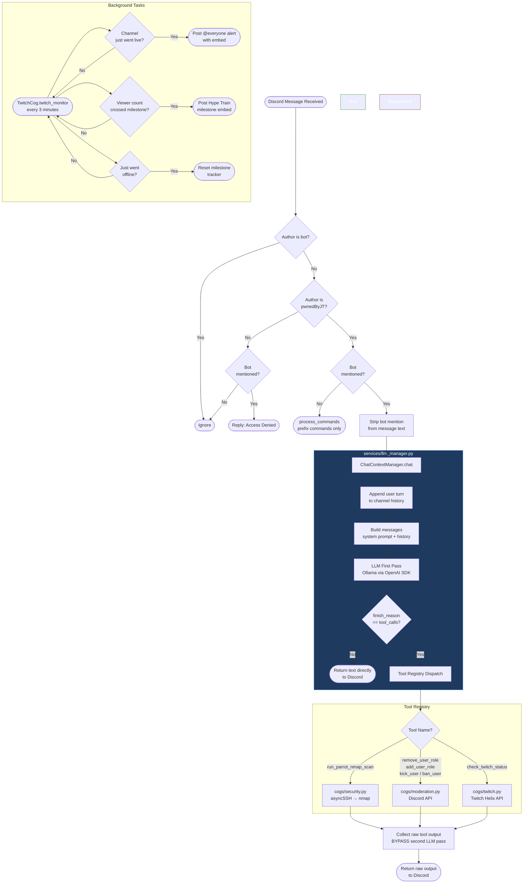

# 🤖 Root AI — Discord Security Pipeline Bot

A production-ready Discord bot with a **local Ollama LLM integration**, SSH-based nmap scanning, Discord moderation tools, and a Twitch live-stream monitor — refactored into a clean, modular **Discord.py Cogs** architecture.

---

## 📁 Project Structure

```
Root-AI/
├── main.py                  ← Entry point: bot init, setup_hook, on_ready
├── config.py                ← Centralised env var loading (single source of truth)
├── requirements.txt         ← Python package dependencies
├── .env                     ← Secrets (never committed — see .gitignore)
├── data/
│   ├── .gitkeep             ← Keeps the data/ directory tracked by git
│   └── rep.json             ← Runtime-generated rep scores (excluded by .gitignore)
├── services/
│   ├── __init__.py
│   └── llm_manager.py       ← ChatContextManager + tool registry (Discord-agnostic)
├── cogs/
│   ├── __init__.py
│   ├── security.py          ← SSH nmap tool + registers with LLM manager
│   ├── moderation.py        ← Role/kick/ban tools + registers with LLM manager
│   ├── twitch.py            ← Twitch monitor + Hype Train milestones + status tool
│   ├── rep.py               ← Community rep system (.rep, .myrep, .leaderboard)
│   └── ai_chat.py           ← on_message gate, mention handler, .ping command
└── bot.py                   ← Original monolith (kept as reference)
```

---

## 🏗️ Architecture & Message Flow



---

## ⚙️ Prerequisites

| Requirement | Version |
|---|---|
| Python | 3.11+ |
| [Ollama](https://ollama.com/) | Running locally |
| LLM Model | `llama3.1` (or any tool-calling capable model) |
| discord.py | 2.x |
| Parrot OS / WSL | For SSH nmap scanning |

### Install dependencies

```bash
pip install -r requirements.txt
```

---

## 🔑 Environment Variables

Create a `.env` file in the project root:

```env
# Discord
ROOT_AI_DISCORD_TOKEN=your_discord_bot_token_here
BOT_PREFIX=.

# Ollama / LLM
LOCAL_LLM_URL=http://localhost:11434/v1
LOCAL_MODEL_NAME=llama3.1

# SSH — Parrot OS WSL workstation
PARROT_HOST=127.0.0.1
PARROT_USER=your_parrot_username
PARROT_PASS=your_parrot_password

# Twitch
ROOT_AI_TWITCH_CLIENT_ID=your_twitch_client_id
ROOT_AI_TWITCH_CLIENT_SECRET=your_twitch_client_secret
```

> **Never commit your `.env` file.** It is already covered by `.gitignore`.

---

## 🚀 Running the Bot

```bash
python main.py
```

---

## 🛠️ Features

### 🔒 Security — `cogs/security.py`
- Runs **nmap scans** via SSH into a Parrot OS WSL instance
- Input is sanitised against allowlist regexes before execution
- Triggered by the LLM when the user asks for a network scan, audit, or socket map

### 🛡️ Moderation — `cogs/moderation.py`
- **Add / Remove** any of the following roles via natural language: `Newcomer`, `Alumni`, `Support`, `Admin`, `R6`
- **Kick** or **Ban** users with a single natural-language request
- Role names are validated against an allowlist before any Discord API call — the LLM cannot assign arbitrary roles
- If no role is specified, Root AI will ask for clarification before acting
- All actions are gated by Discord's own permission hierarchy

### 📺 Twitch — `cogs/twitch.py`
- **On-demand status check** — ask the bot if the stream is live
- **Background monitor** — polls every 3 minutes and posts a `@everyone` alert with an embed the moment the channel transitions from offline → live
- **🚂 Hype Train** — fires a milestone embed (no @everyone spam) each time concurrent viewers first cross a threshold: **5 → 10 → 15 → 25 → 35 → 50 → 75 → 100**
  - Milestones are one-shot per stream — no re-fires if viewers dip and recover
  - Tracking resets automatically when the stream ends
- App Access Token is cached and auto-refreshed (~60-day TTL)

### ⭐ Rep System — `cogs/rep.py`
Community reputation points — driven entirely by prefix commands (no LLM involvement).

| Command | Description |
|---|---|
| `.rep @user` | Give one rep point to a member. 24-hour cooldown per giver (regardless of target). |
| `.myrep` | Show your own reputation count. |
| `.leaderboard` (or `.top`) | Show the top 10 community members by rep score. |

- **Self-rep prevention** — you cannot give rep to yourself
- **24-hour cooldown** — one rep given per day, period
- **Persistent storage** — scores saved to `data/rep.json` (excluded from git)
- **Thread-safe I/O** — all file access is serialised via `asyncio.Lock` and offloaded to a thread pool

### 🤖 AI Chat — `cogs/ai_chat.py`
- **Access gate** — only the authorised owner (`pwnedByJT`) can interact with the bot; all other `@mentions` receive an access-denied reply
- Strips the bot's own mention tag while **preserving target user mentions** in the text (so moderation commands work correctly)
- **BYPASS second LLM pass** — raw tool output is returned directly to Discord, ensuring `<@ID>` tags and nmap terminal output are never mangled by the model

### 🧠 LLM Manager — `services/llm_manager.py`
- Maintains **per-channel conversation history** (rolling 20-message window)
- **Tool registry** — cogs register `(handler, spec)` pairs at load time; the dispatcher is fully decoupled from cog implementations
- Compatible with any **OpenAI-spec endpoint** (Ollama, OpenAI, etc.)

---

## 🧩 Adding a New Tool

1. Implement your async function in the appropriate cog (or a new one).
2. Define its OpenAI tool spec dict.
3. In your Cog's `__init__`, register it:

```python
self._chat.register_tool("my_tool_name", my_handler, MY_TOOL_SPEC)
```

4. Add the extension to `EXTENSIONS` in `main.py` if it's a new cog.
5. Update the system prompt in `services/llm_manager.py` to teach the LLM when to call it.

---

## 📋 Bot Permissions Required

| Permission | Used by |
|---|---|
| Read Messages / View Channels | All |
| Send Messages | All |
| Manage Roles | `moderation.py` — add/remove Newcomer, Alumni, Support, Admin, R6 roles |
| Kick Members | `moderation.py` — kick command |
| Ban Members | `moderation.py` — ban command |
| Message Content Intent | `ai_chat.py` — reading @mention content |
| Server Members Intent | `moderation.py` — resolving user IDs to members |

---

## 🌀 Magic applied with [Wibey VS Code Extension](https://wibey.walmart.com/code) 🪄
